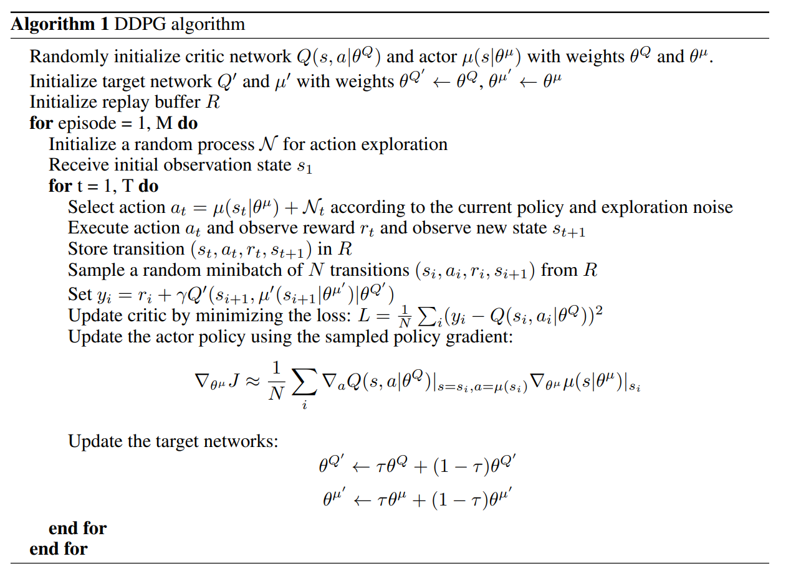

# Learning Algorithm
The Reinforcement Learning algorithm used to **solve** the environment was [Deep Deterministic Policy Gradient(DDPG)](https://arxiv.org/abs/1509.02971)

## Model
```
Actor Local DDPG -> Actor(
  (fc1): Linear(in_features=33, out_features=400, bias=True)
  (fc2): Linear(in_features=400, out_features=300, bias=True)
  (fc3): Linear(in_features=300, out_features=4, bias=True)
)
Actor Target DDPG -> Actor(
  (fc1): Linear(in_features=33, out_features=400, bias=True)
  (fc2): Linear(in_features=400, out_features=300, bias=True)
  (fc3): Linear(in_features=300, out_features=4, bias=True)
)
Critic Local DDPG -> Critic(
  (fcs1): Linear(in_features=33, out_features=400, bias=True)
  (fc2): Linear(in_features=404, out_features=300, bias=True)
  (fc3): Linear(in_features=300, out_features=50, bias=True)
  (fc4): Linear(in_features=50, out_features=1, bias=True)
)
Critic Target DDPG -> Critic(
  (fcs1): Linear(in_features=33, out_features=400, bias=True)
  (fc2): Linear(in_features=404, out_features=300, bias=True)
  (fc3): Linear(in_features=300, out_features=50, bias=True)
  (fc4): Linear(in_features=50, out_features=1, bias=True)
)
```

## Hyperparameters used for training
* Total Episodes: 200
* Replay Buffer size: 1.000.000
* Replay Buffer Sample Batch Size:  64 (times the number of agents. i.e. 64 x 20 agents -> Final batch size: 1280)
* Gamma: 0.99 (discount factor)
* Actor Local Learning Rate: 1e-4
* Critic Local Learning Rate: 1e-3
* Tau: 1e-3 (soft update from local actor and critic network parameters to their respective target network parameters)
* Actor Local Weight Decay: 0 (L2 weight decay for the Actor local)

# Plot of Rewards
```
Ep. 1/200 - Avg Global Score: 0.52 - Avg Ep. Score: 0.52 - Min Ep. Score: 0.00 - Max Ep. Score: 1.10
Ep. 2/200 - Avg Global Score: 0.41 - Avg Ep. Score: 0.29 - Min Ep. Score: 0.00 - Max Ep. Score: 0.86
Ep. 3/200 - Avg Global Score: 0.52 - Avg Ep. Score: 0.76 - Min Ep. Score: 0.00 - Max Ep. Score: 1.85
Ep. 4/200 - Avg Global Score: 0.66 - Avg Ep. Score: 1.06 - Min Ep. Score: 0.00 - Max Ep. Score: 2.73
Ep. 5/200 - Avg Global Score: 0.79 - Avg Ep. Score: 1.29 - Min Ep. Score: 0.48 - Max Ep. Score: 2.32
Ep. 6/200 - Avg Global Score: 0.90 - Avg Ep. Score: 1.50 - Min Ep. Score: 0.32 - Max Ep. Score: 2.83
Ep. 7/200 - Avg Global Score: 1.08 - Avg Ep. Score: 2.11 - Min Ep. Score: 1.29 - Max Ep. Score: 3.63
Ep. 8/200 - Avg Global Score: 1.32 - Avg Ep. Score: 3.04 - Min Ep. Score: 1.92 - Max Ep. Score: 5.83
Ep. 9/200 - Avg Global Score: 1.57 - Avg Ep. Score: 3.51 - Min Ep. Score: 1.45 - Max Ep. Score: 6.01
Ep. 10/200 - Avg Global Score: 1.80 - Avg Ep. Score: 3.94 - Min Ep. Score: 1.80 - Max Ep. Score: 6.63
Ep. 11/200 - Avg Global Score: 2.03 - Avg Ep. Score: 4.27 - Min Ep. Score: 1.82 - Max Ep. Score: 6.58
Ep. 12/200 - Avg Global Score: 2.32 - Avg Ep. Score: 5.54 - Min Ep. Score: 3.23 - Max Ep. Score: 10.72
Ep. 13/200 - Avg Global Score: 2.69 - Avg Ep. Score: 7.14 - Min Ep. Score: 4.10 - Max Ep. Score: 10.30
Ep. 14/200 - Avg Global Score: 3.11 - Avg Ep. Score: 8.54 - Min Ep. Score: 4.26 - Max Ep. Score: 14.38
Ep. 15/200 - Avg Global Score: 3.69 - Avg Ep. Score: 11.85 - Min Ep. Score: 5.58 - Max Ep. Score: 20.56
Ep. 16/200 - Avg Global Score: 4.37 - Avg Ep. Score: 14.60 - Min Ep. Score: 9.07 - Max Ep. Score: 25.15
Ep. 17/200 - Avg Global Score: 5.12 - Avg Ep. Score: 17.03 - Min Ep. Score: 7.61 - Max Ep. Score: 29.67
Ep. 18/200 - Avg Global Score: 6.03 - Avg Ep. Score: 21.48 - Min Ep. Score: 15.40 - Max Ep. Score: 29.24
Ep. 19/200 - Avg Global Score: 6.99 - Avg Ep. Score: 24.26 - Min Ep. Score: 16.00 - Max Ep. Score: 36.23
Ep. 20/200 - Avg Global Score: 7.99 - Avg Ep. Score: 27.14 - Min Ep. Score: 20.48 - Max Ep. Score: 31.82
Ep. 21/200 - Avg Global Score: 8.91 - Avg Ep. Score: 27.14 - Min Ep. Score: 16.57 - Max Ep. Score: 38.68
Ep. 22/200 - Avg Global Score: 9.93 - Avg Ep. Score: 31.37 - Min Ep. Score: 24.62 - Max Ep. Score: 37.86
Ep. 23/200 - Avg Global Score: 10.95 - Avg Ep. Score: 33.35 - Min Ep. Score: 23.91 - Max Ep. Score: 39.62
Ep. 24/200 - Avg Global Score: 11.94 - Avg Ep. Score: 34.75 - Min Ep. Score: 29.46 - Max Ep. Score: 39.56
Ep. 25/200 - Avg Global Score: 12.86 - Avg Ep. Score: 34.96 - Min Ep. Score: 29.54 - Max Ep. Score: 39.00
Ep. 26/200 - Avg Global Score: 13.74 - Avg Ep. Score: 35.69 - Min Ep. Score: 25.93 - Max Ep. Score: 39.63
Ep. 27/200 - Avg Global Score: 14.55 - Avg Ep. Score: 35.77 - Min Ep. Score: 25.31 - Max Ep. Score: 39.50
Ep. 28/200 - Avg Global Score: 15.35 - Avg Ep. Score: 36.94 - Min Ep. Score: 33.50 - Max Ep. Score: 39.58
Ep. 29/200 - Avg Global Score: 16.11 - Avg Ep. Score: 37.21 - Min Ep. Score: 33.22 - Max Ep. Score: 39.58
Ep. 30/200 - Avg Global Score: 16.78 - Avg Ep. Score: 36.28 - Min Ep. Score: 23.63 - Max Ep. Score: 39.53
Ep. 31/200 - Avg Global Score: 17.40 - Avg Ep. Score: 35.98 - Min Ep. Score: 29.60 - Max Ep. Score: 39.52
Ep. 32/200 - Avg Global Score: 18.03 - Avg Ep. Score: 37.69 - Min Ep. Score: 32.39 - Max Ep. Score: 39.60
Ep. 33/200 - Avg Global Score: 18.63 - Avg Ep. Score: 37.83 - Min Ep. Score: 28.09 - Max Ep. Score: 39.63
Ep. 34/200 - Avg Global Score: 19.20 - Avg Ep. Score: 37.81 - Min Ep. Score: 30.39 - Max Ep. Score: 39.59
Ep. 35/200 - Avg Global Score: 19.71 - Avg Ep. Score: 37.04 - Min Ep. Score: 23.59 - Max Ep. Score: 39.60
Ep. 36/200 - Avg Global Score: 20.21 - Avg Ep. Score: 37.79 - Min Ep. Score: 29.82 - Max Ep. Score: 39.61
Ep. 37/200 - Avg Global Score: 20.65 - Avg Ep. Score: 36.53 - Min Ep. Score: 29.67 - Max Ep. Score: 39.53
Ep. 38/200 - Avg Global Score: 21.10 - Avg Ep. Score: 37.59 - Min Ep. Score: 32.62 - Max Ep. Score: 39.60
Ep. 39/200 - Avg Global Score: 21.50 - Avg Ep. Score: 36.93 - Min Ep. Score: 25.06 - Max Ep. Score: 39.55
Ep. 40/200 - Avg Global Score: 21.87 - Avg Ep. Score: 36.39 - Min Ep. Score: 28.88 - Max Ep. Score: 39.57
Ep. 41/200 - Avg Global Score: 22.24 - Avg Ep. Score: 37.06 - Min Ep. Score: 27.80 - Max Ep. Score: 39.55
Ep. 42/200 - Avg Global Score: 22.61 - Avg Ep. Score: 37.59 - Min Ep. Score: 28.31 - Max Ep. Score: 39.63
Ep. 43/200 - Avg Global Score: 22.95 - Avg Ep. Score: 37.12 - Min Ep. Score: 28.75 - Max Ep. Score: 39.59
Ep. 44/200 - Avg Global Score: 23.28 - Avg Ep. Score: 37.43 - Min Ep. Score: 24.60 - Max Ep. Score: 39.56
Ep. 45/200 - Avg Global Score: 23.57 - Avg Ep. Score: 36.58 - Min Ep. Score: 27.79 - Max Ep. Score: 39.58
Ep. 46/200 - Avg Global Score: 23.86 - Avg Ep. Score: 37.06 - Min Ep. Score: 27.05 - Max Ep. Score: 39.52
Ep. 47/200 - Avg Global Score: 24.15 - Avg Ep. Score: 37.15 - Min Ep. Score: 33.11 - Max Ep. Score: 39.38
Ep. 48/200 - Avg Global Score: 24.40 - Avg Ep. Score: 36.30 - Min Ep. Score: 25.15 - Max Ep. Score: 39.62
Ep. 49/200 - Avg Global Score: 24.66 - Avg Ep. Score: 36.87 - Min Ep. Score: 28.52 - Max Ep. Score: 39.50
Ep. 50/200 - Avg Global Score: 24.93 - Avg Ep. Score: 38.33 - Min Ep. Score: 34.68 - Max Ep. Score: 39.57
Ep. 51/200 - Avg Global Score: 25.18 - Avg Ep. Score: 37.56 - Min Ep. Score: 31.54 - Max Ep. Score: 39.60
Ep. 52/200 - Avg Global Score: 25.40 - Avg Ep. Score: 36.96 - Min Ep. Score: 27.85 - Max Ep. Score: 39.48
Ep. 53/200 - Avg Global Score: 25.63 - Avg Ep. Score: 37.33 - Min Ep. Score: 26.79 - Max Ep. Score: 39.58
Ep. 54/200 - Avg Global Score: 25.82 - Avg Ep. Score: 36.15 - Min Ep. Score: 26.72 - Max Ep. Score: 39.46
Ep. 55/200 - Avg Global Score: 26.01 - Avg Ep. Score: 36.14 - Min Ep. Score: 26.29 - Max Ep. Score: 39.60
Ep. 56/200 - Avg Global Score: 26.23 - Avg Ep. Score: 38.32 - Min Ep. Score: 35.10 - Max Ep. Score: 39.62
Ep. 57/200 - Avg Global Score: 26.42 - Avg Ep. Score: 36.88 - Min Ep. Score: 33.63 - Max Ep. Score: 39.58
Ep. 58/200 - Avg Global Score: 26.59 - Avg Ep. Score: 36.42 - Min Ep. Score: 33.09 - Max Ep. Score: 39.58
Ep. 59/200 - Avg Global Score: 26.78 - Avg Ep. Score: 37.58 - Min Ep. Score: 30.38 - Max Ep. Score: 39.58
Ep. 60/200 - Avg Global Score: 26.95 - Avg Ep. Score: 37.17 - Min Ep. Score: 28.02 - Max Ep. Score: 39.55
Ep. 61/200 - Avg Global Score: 27.11 - Avg Ep. Score: 36.97 - Min Ep. Score: 27.57 - Max Ep. Score: 39.60
Ep. 62/200 - Avg Global Score: 27.27 - Avg Ep. Score: 36.98 - Min Ep. Score: 29.40 - Max Ep. Score: 39.61
Ep. 63/200 - Avg Global Score: 27.43 - Avg Ep. Score: 37.11 - Min Ep. Score: 26.97 - Max Ep. Score: 39.49
Ep. 64/200 - Avg Global Score: 27.57 - Avg Ep. Score: 36.38 - Min Ep. Score: 32.19 - Max Ep. Score: 39.58
Ep. 65/200 - Avg Global Score: 27.71 - Avg Ep. Score: 36.54 - Min Ep. Score: 26.01 - Max Ep. Score: 39.60
Ep. 66/200 - Avg Global Score: 27.86 - Avg Ep. Score: 37.58 - Min Ep. Score: 33.91 - Max Ep. Score: 39.61
Ep. 67/200 - Avg Global Score: 27.98 - Avg Ep. Score: 36.03 - Min Ep. Score: 25.09 - Max Ep. Score: 39.51
Ep. 68/200 - Avg Global Score: 28.11 - Avg Ep. Score: 36.97 - Min Ep. Score: 26.21 - Max Ep. Score: 39.56
Ep. 69/200 - Avg Global Score: 28.23 - Avg Ep. Score: 36.30 - Min Ep. Score: 17.97 - Max Ep. Score: 39.58
Ep. 70/200 - Avg Global Score: 28.35 - Avg Ep. Score: 36.94 - Min Ep. Score: 27.30 - Max Ep. Score: 39.59
Ep. 71/200 - Avg Global Score: 28.46 - Avg Ep. Score: 36.09 - Min Ep. Score: 30.88 - Max Ep. Score: 39.54
Ep. 72/200 - Avg Global Score: 28.58 - Avg Ep. Score: 36.72 - Min Ep. Score: 29.69 - Max Ep. Score: 39.31
Ep. 73/200 - Avg Global Score: 28.69 - Avg Ep. Score: 37.03 - Min Ep. Score: 25.26 - Max Ep. Score: 39.56
Ep. 74/200 - Avg Global Score: 28.80 - Avg Ep. Score: 36.76 - Min Ep. Score: 28.27 - Max Ep. Score: 39.52
Ep. 75/200 - Avg Global Score: 28.91 - Avg Ep. Score: 36.83 - Min Ep. Score: 31.99 - Max Ep. Score: 39.51
Ep. 76/200 - Avg Global Score: 29.00 - Avg Ep. Score: 36.15 - Min Ep. Score: 32.72 - Max Ep. Score: 39.70
Ep. 77/200 - Avg Global Score: 29.11 - Avg Ep. Score: 36.80 - Min Ep. Score: 29.83 - Max Ep. Score: 39.68
Ep. 78/200 - Avg Global Score: 29.20 - Avg Ep. Score: 36.80 - Min Ep. Score: 30.03 - Max Ep. Score: 39.65
Ep. 79/200 - Avg Global Score: 29.31 - Avg Ep. Score: 37.16 - Min Ep. Score: 33.72 - Max Ep. Score: 39.52
Ep. 80/200 - Avg Global Score: 29.39 - Avg Ep. Score: 36.26 - Min Ep. Score: 25.09 - Max Ep. Score: 39.41
Ep. 81/200 - Avg Global Score: 29.49 - Avg Ep. Score: 37.64 - Min Ep. Score: 28.36 - Max Ep. Score: 39.59
Ep. 82/200 - Avg Global Score: 29.59 - Avg Ep. Score: 37.10 - Min Ep. Score: 32.36 - Max Ep. Score: 39.62
Ep. 83/200 - Avg Global Score: 29.67 - Avg Ep. Score: 36.43 - Min Ep. Score: 25.94 - Max Ep. Score: 39.65
Ep. 84/200 - Avg Global Score: 29.76 - Avg Ep. Score: 37.24 - Min Ep. Score: 33.05 - Max Ep. Score: 39.66
Ep. 85/200 - Avg Global Score: 29.82 - Avg Ep. Score: 35.06 - Min Ep. Score: 25.13 - Max Ep. Score: 39.55
Ep. 86/200 - Avg Global Score: 29.91 - Avg Ep. Score: 37.71 - Min Ep. Score: 30.43 - Max Ep. Score: 39.56
Ep. 87/200 - Avg Global Score: 30.01 - Avg Ep. Score: 38.68 - Min Ep. Score: 33.39 - Max Ep. Score: 39.68
Ep. 88/200 - Avg Global Score: 30.10 - Avg Ep. Score: 37.75 - Min Ep. Score: 34.49 - Max Ep. Score: 39.65
Ep. 89/200 - Avg Global Score: 30.19 - Avg Ep. Score: 37.73 - Min Ep. Score: 30.70 - Max Ep. Score: 39.62
Ep. 90/200 - Avg Global Score: 30.25 - Avg Ep. Score: 36.16 - Min Ep. Score: 31.17 - Max Ep. Score: 39.59
Ep. 91/200 - Avg Global Score: 30.34 - Avg Ep. Score: 37.72 - Min Ep. Score: 32.85 - Max Ep. Score: 39.66
Ep. 92/200 - Avg Global Score: 30.41 - Avg Ep. Score: 37.36 - Min Ep. Score: 24.26 - Max Ep. Score: 39.57
Ep. 93/200 - Avg Global Score: 30.49 - Avg Ep. Score: 37.67 - Min Ep. Score: 30.66 - Max Ep. Score: 39.56
Ep. 94/200 - Avg Global Score: 30.56 - Avg Ep. Score: 36.64 - Min Ep. Score: 25.29 - Max Ep. Score: 39.33
Ep. 95/200 - Avg Global Score: 30.63 - Avg Ep. Score: 37.49 - Min Ep. Score: 30.17 - Max Ep. Score: 39.56
Ep. 96/200 - Avg Global Score: 30.69 - Avg Ep. Score: 36.55 - Min Ep. Score: 28.88 - Max Ep. Score: 39.51
Ep. 97/200 - Avg Global Score: 30.76 - Avg Ep. Score: 37.00 - Min Ep. Score: 32.05 - Max Ep. Score: 39.58
Ep. 98/200 - Avg Global Score: 30.80 - Avg Ep. Score: 35.60 - Min Ep. Score: 28.40 - Max Ep. Score: 39.50
Ep. 99/200 - Avg Global Score: 30.87 - Avg Ep. Score: 36.95 - Min Ep. Score: 24.95 - Max Ep. Score: 39.59
Ep. 100/200 -Avg Global Score: 30.94 - Avg Ep. Score: 37.68 - Min Ep. Score: 27.88 - Max Ep. Score: 39.61
```
Environment solved (mean of 30.0 for 100 episodes) in **100** episodes!     Average Score: **30.94**

### Detailed execution logs: [here](/results/result-ddpg.txt)

<h3 align="center">Score evolution</h3>
<p align="center">
  
</p>

# Ideas for Future Work

1. Hyperparameter tuning:
    * Use non-zero Learning Rate weight decay for the Actor Local to stabilize the score closer to 40.0
    * Find the optimal the Neural Network sizes)
2. Switch the Uniform Replay Buffer to [Prioritized Experience Replay](https://arxiv.org/abs/1511.05952) to speed up converge
3. Implement [PPO](https://arxiv.org/abs/1707.06347) algorithm to compare performance with the DDPG
4. Implement [A3C](https://arxiv.org/abs/1602.01783) algorithm to compare performance with the DDPG
5. Implement [D4PG](https://arxiv.org/abs/1804.08617) algorithm to compare performance with the DDPG
6. Implement [Multi Agent DDPG(MADDPG)](https://arxiv.org/abs/1706.02275) algorithm to compare performance with the DDPG
7. Switch the agent to learn from pixels
